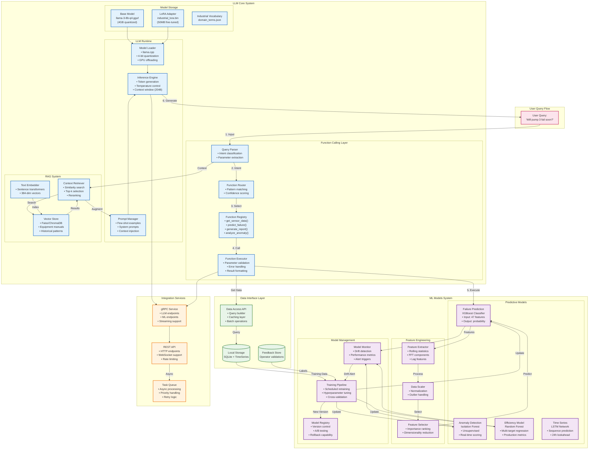

# KairOS Industrial Platform (IMP-2025)

An offline-first industrial monitoring platform that brings edge AI/ML capabilities to Industry 4.0 environments. Built for resilience, autonomy, and real-time decision making at the edge.

## Vision

Transform industrial operations through intelligent edge computing that operates autonomously, predicts failures before they happen, and provides operators with AI-powered insights - all without cloud dependency.

## Key Features

### Edge-First Architecture
- **Fully Autonomous**: Operates for 30+ days without cloud connectivity
- **Local AI/ML**: On-device inference with <100ms response time
- **Offline-First**: All critical functions work without internet

### Dual Interface Design
- **Rust Terminal UI**: ASCII-based monitoring accessible via SSH - always available even when other systems fail
- **React Web Dashboard**: Modern, responsive interface for comprehensive monitoring
- **Integrated LLM Chat**: Natural language queries in both interfaces

### AI/ML Capabilities
- **Local LLM**: Llama 3 8B (quantized) with industrial fine-tuning
- **Predictive Maintenance**: XGBoost models for failure prediction
- **Anomaly Detection**: Real-time pattern recognition
- **Natural Language**: Ask questions like "Why is pump 3 vibrating?" and get intelligent answers

### Industrial Protocol Support
- MQTT, Modbus TCP/RTU, OPC-UA
- ISA-95 enterprise integration
- Extensible adapter framework
- Custom protocol SDK

## Detailed System Architecture

```mermaid
---
id: 658dae3e-5bf8-4c42-ab98-95504670b402
---
graph TB
    subgraph "Edge Device - KairOS Linux"
        subgraph "Local Data Storage"
            LOCALDB[("Local File Storage<br/>• nucleus.db (SQLite)<br/>• timeseries.tsdb<br/>• recent_24h.db (cache)<br/>• blackbox.bin")]
            VECTOR[("Vector Store<br/>RAG Context")]
        end
        
        subgraph "AI/ML Layer"
            LLM["Llama 3 8B Quantized<br/>+ Industrial LoRA Adapter<br/>+ RAG Retrieval"]
            FUNC["Function Registry<br/>& Router"]
            ML["Python ML Models<br/>• XGBoost (Failure)<br/>• LSTM (Anomaly)<br/>• Random Forest (Efficiency)"]
            MLPIPE["ML Pipeline<br/>• Feature Engineering<br/>• Model Retraining<br/>• A/B Testing<br/>• Drift Detection"]
            
            LLM -->|"Calls Functions"| FUNC
            FUNC -->|"Execute"| ML
            ML -->|"Predictions"| FUNC
            FUNC -->|"Query Local Data"| LOCALDB
            LLM -->|"Retrieve Context"| VECTOR
            MLPIPE -->|"Update Models"| ML
            MLPIPE -->|"Read Training Data"| LOCALDB
            MLPIPE -->|"Update Context"| VECTOR
        end
        
        subgraph "Communication Layer"
            GRPC["gRPC Adapter Framework"]
            MQTT["MQTT Adapter"]
            MODBUS["Modbus Adapter"]
            OPCUA["OPC-UA Adapter"]
            ISA95["ISA-95 Adapter"]
            CUSTOM["Custom Protocol Adapters"]
            
            GRPC --> MQTT
            GRPC --> MODBUS
            GRPC --> OPCUA
            GRPC --> ISA95
            GRPC --> CUSTOM
        end
        
        subgraph "User Interface Layer"
            TUI["Rust Terminal UI<br/>• ASCII Visualization<br/>• LLM Chat Interface<br/>• System Admin"]
            WEBSERVER["Rust Web Server<br/>• WebSocket Stream<br/>• REST APIs"]
            REACT["React Dashboard<br/>(Served by Rust)"]
            
            WEBSERVER -->|"Serves"| REACT
        end
        
        subgraph "System Services"
            SYSTEMD["Systemd Services<br/>• llm-engine.service<br/>• nucleus.service<br/>• ml-pipeline.service<br/>• sync.service"]
            OTA["OTA Update Manager"]
            SYNC["Sync Service<br/>(Hourly batches)"]
        end
        
        subgraph "Feedback Loop"
            FEEDBACK[("Operator Feedback DB")]
            LEARNING["Continuous Learning<br/>• Error Analysis<br/>• Pattern Recognition"]
        end
    end
    
    subgraph "Industrial Equipment"
        SENSORS["Sensors<br/>Temperature, Pressure,<br/>Vibration, Flow"]
        PLCS["PLCs & Controllers"]
        SCADA["SCADA Systems"]
        ERP["ERP Systems<br/>(SAP, Oracle)"]
    end
    
    subgraph "Cloud Services (Periodic Sync)"
        TIMESCALE[("TimescaleDB<br/>Aggregated Historical")]
        TRAINING["Cloud ML Training<br/>• Deep Learning<br/>• Cross-Site Patterns"]
        MARKETPLACE["Adapter Marketplace"]
    end
    
    subgraph "User Interactions"
        OPERATOR["Operator"]
        ENGINEER["Engineer"]
        MANAGER["Manager"]
    end
    
    %% Data Flow - Equipment to Platform
    SENSORS -->|"Raw Data"| MODBUS
    SENSORS -->|"Raw Data"| MQTT
    PLCS -->|"Control Data"| OPCUA
    SCADA -->|"Process Data"| OPCUA
    ERP -->|"Business Data"| ISA95
    
    %% Adapter to Local Storage
    MQTT -->|"Write"| LOCALDB
    MODBUS -->|"Write"| LOCALDB
    OPCUA -->|"Write"| LOCALDB
    ISA95 -->|"Write"| LOCALDB
    CUSTOM -->|"Write"| LOCALDB
    
    %% UI Data Access
    TUI -->|"Query Local DB"| LOCALDB
    TUI -->|"LLM Query"| LLM
    WEBSERVER -->|"Query Local DB"| LOCALDB
    WEBSERVER -->|"LLM Query"| LLM
    
    %% LLM Function Calling Flow
    LLM -->|"Query"| LOCALDB
    LLM -->|"Run Prediction"| ML
    ML -->|"Read Historical"| LOCALDB
    
    %% ML Pipeline Flow
    MLPIPE -->|"Deploy Updates"| LLM
    LEARNING -->|"Improve Models"| MLPIPE
    FEEDBACK -->|"Training Data"| LEARNING
    
    %% Cloud Sync (Dotted = Periodic)
    SYNC -.->|"Batch Upload"| TIMESCALE
    LOCALDB -.->|"Hourly Sync"| SYNC
    TIMESCALE -.->|"Advanced Models"| TRAINING
    TRAINING -.->|"Model Updates"| ML
    TRAINING -.->|"LoRA Updates"| LLM
    MARKETPLACE -.->|"New Adapters"| CUSTOM
    
    %% User Access
    OPERATOR --> TUI
    OPERATOR --> REACT
    OPERATOR -->|"Validates"| FEEDBACK
    ENGINEER --> TUI
    MANAGER --> REACT
    
    %% System Management
    SYSTEMD --> LLM
    SYSTEMD --> LOCALDB
    SYSTEMD --> GRPC
    SYSTEMD --> WEBSERVER
    SYSTEMD --> MLPIPE
    SYSTEMD --> SYNC
    OTA --> LLM
    OTA --> ML
    
    %% Styling
    classDef aiComponent fill:#e1f5fe,stroke:#01579b,stroke-width:2px
    classDef dataComponent fill:#f3e5f5,stroke:#4a148c,stroke-width:2px
    classDef uiComponent fill:#e8f5e9,stroke:#1b5e20,stroke-width:2px
    classDef commComponent fill:#fff3e0,stroke:#e65100,stroke-width:2px
    classDef external fill:#fce4ec,stroke:#880e4f,stroke-width:2px
    classDef learning fill:#fff9c4,stroke:#f57f17,stroke-width:2px
    
    class LLM,ML,FUNC,MLPIPE aiComponent
    class LOCALDB,VECTOR,FEEDBACK dataComponent
    class TUI,WEBSERVER,REACT uiComponent
    class GRPC,MQTT,MODBUS,OPCUA,ISA95,CUSTOM commComponent
    class SENSORS,PLCS,SCADA,ERP,TIMESCALE,TRAINING,MARKETPLACE external
    class LEARNING,SYNC learning
```


This diagram shows the complete data flow from industrial equipment through our edge platform to cloud services.

## ML/LLM Architecture Diagram
Our AI system uses a sophisticated function-calling architecture with local LLM and specialized ML models:


## How It Works
1. User queries are parsed by the LLM
2. LLM calls appropriate functions
3. ML models provide predictions
4. Results are formatted in natural language

## KairOS Filesystem Layout

The following diagram shows how components are organized on the deployed edge device:

```mermaid
graph TD
    ROOT["/"]
    
    ROOT --> BIN["/bin<br/>Essential user binaries"]
    ROOT --> SBIN["/sbin<br/>System binaries"]
    ROOT --> ETC["/etc<br/>System configuration"]
    ROOT --> OPT["/opt<br/>Industrial platform"]
    ROOT --> VAR["/var<br/>Variable data"]
    ROOT --> USR["/usr<br/>User programs"]
    ROOT --> HOME["/home<br/>User directories"]
    ROOT --> LIB["/lib<br/>System libraries"]
    ROOT --> TMP["/tmp<br/>Temporary files"]
    ROOT --> DEV["/dev<br/>Device files"]
    ROOT --> PROC["/proc<br/>Process info"]
    ROOT --> SYS["/sys<br/>Kernel info"]
    
    ETC --> SYSTEMD["/etc/systemd/system<br/>Service definitions"]
    ETC --> INDUSTRIAL["/etc/industrial-ai<br/>Platform configs"]
    
    SYSTEMD --> SERVICES["• llm-engine.service<br/>• ml-pipeline.service<br/>• nucleus.service<br/>• grpc-adapter.service<br/>• rust-tui.service<br/>• web-server.service<br/>• sync.service"]
    
    INDUSTRIAL --> CONFIGS["• resource_limits.conf<br/>• adapters.yaml<br/>• functions.json<br/>• prompts.yaml"]
    
    OPT --> INDAI["/opt/industrial-ai<br/>Main application"]
    
    INDAI --> AIBIN["/opt/industrial-ai/bin<br/>Application binaries"]
    INDAI --> MODELS["/opt/industrial-ai/models<br/>AI/ML models"]
    INDAI --> ADAPTERS["/opt/industrial-ai/adapters<br/>Protocol adapters"]
    INDAI --> SERVICES_DIR["/opt/industrial-ai/services<br/>Service scripts"]
    INDAI --> DOCUMENTATION["/opt/industrial-ai/documentation<br/>Equipment manuals"]
    INDAI --> WEB["/opt/industrial-ai/web<br/>React dashboard"]
    
    AIBIN --> BINARIES["• llm_server (Rust)<br/>• tui_dashboard (Rust)<br/>• ml_inference (Python)<br/>• feature_extractor (C++)<br/>• grpc_server (Rust)<br/>• web_server (Rust)"]
    
    MODELS --> MODEL_FILES["• llama-3-8b-q4.gguf (4GB)<br/>• industrial_lora.bin (50MB)<br/>• xgboost_failure.pkl<br/>• anomaly_lstm.pkl<br/>• efficiency_rf.pkl<br/>• versions/<br/>  └── model_history"]
    
    ADAPTERS --> ADAPTER_FILES["• mqtt_adapter.so<br/>• modbus_adapter.so<br/>• opcua_adapter.so<br/>• isa95_adapter.so<br/>• custom/<br/>  └── user_adapters"]
    
    DOCUMENTATION --> DOCS["• common/<br/>  ├── siemens_plc.pdf<br/>  ├── abb_drives.pdf<br/>  └── rosemount.pdf<br/>• custom/<br/>  └── facility_specific.pdf<br/>• indexed/<br/>  └── rag_embeddings.db"]
    
    WEB --> WEBFILES["• index.html<br/>• static/<br/>  ├── js/<br/>  ├── css/<br/>  └── assets/"]
    
    VAR --> VARDATA["/var/industrial-data<br/>Runtime data"]
    VAR --> VARLOG["/var/log<br/>System logs"]
    VAR --> VARLIB["/var/lib<br/>Persistent state"]
    
    VARDATA --> DATA_FILES["• nucleus.db (SQLite)<br/>• timeseries/<br/>  ├── sensor_data.tsdb<br/>  ├── events.db<br/>  └── blackbox.bin<br/>• cache/<br/>  └── recent_24h.db<br/>• feedback.db<br/>• vector_store/<br/>  └── faiss.index"]
    
    VARLOG --> LOGS["• industrial-ai/<br/>  ├── llm.log<br/>  ├── ml-pipeline.log<br/>  └── nucleus.log<br/>• systemd/journal/"]
    
    VARLIB --> STATE["• industrial-ai/<br/>  ├── model_registry.json<br/>  ├── adapter_state/<br/>  └── sync_status.db"]
    
    USR --> USRLOCAL["/usr/local<br/>Custom builds"]
    USR --> USRLIB["/usr/lib<br/>Shared libraries"]
    USR --> USRBIN["/usr/bin<br/>User commands"]
    
    USRLIB --> LIBS["• python3.11/<br/>  └── site-packages/<br/>      ├── numpy/<br/>      ├── scikit-learn/<br/>      └── torch/<br/>• libllama.so<br/>• libgrpc.so"]
    
    HOME --> OPERATOR["/home/operator<br/>Operator user"]
    
    OPERATOR --> USER_FILES["• .config/<br/>  └── tui_preferences<br/>• scripts/<br/>  └── custom_queries.py<br/>• exports/<br/>  └── reports/"]
    
    TMP --> TEMP_FILES["/tmp<br/>• model_inference/<br/>• feature_cache/<br/>• upload_staging/"]
    
    classDef systemDir fill:#e3f2fd,stroke:#1565c0,stroke-width:2px
    classDef appDir fill:#f3e5f5,stroke:#6a1b9a,stroke-width:2px
    classDef dataDir fill:#e8f5e9,stroke:#2e7d32,stroke-width:2px
    classDef configDir fill:#fff3e0,stroke:#ef6c00,stroke-width:2px
    classDef tempDir fill:#ffebee,stroke:#c62828,stroke-width:2px
    
    class ROOT,BIN,SBIN,USR,LIB,DEV,PROC,SYS systemDir
    class OPT,INDAI,AIBIN,MODELS,ADAPTERS,SERVICES_DIR,DOCUMENTATION,WEB appDir
    class VAR,VARDATA,VARLOG,VARLIB,DATA_FILES,STATE dataDir
    class ETC,SYSTEMD,INDUSTRIAL,CONFIGS,HOME,OPERATOR configDir
    class TMP,TEMP_FILES tempDir
```




## Quick Start

### Prerequisites
- Docker Desktop
- 16GB+ RAM
- 50GB+ available storage

### Development Setup

```bash
# Clone the repository
git clone https://github.com/gallarus-industry-solutions/kairos-industrial-platform.git
cd kairos-industrial-platform

# Start development environment
docker-compose up -d

# Download LLM model
docker exec ollama ollama pull llama3:8b

# Install dependencies
cd ai && pip install -r requirements.txt
```

### Running the Platform

```bash
# Start all services
./scripts/start-platform.sh

# Access Terminal UI
ssh operator@localhost -p 2222

# Access Web Dashboard
open http://localhost:3000
```

## Project Structure

```
kairos-industrial-platform/
├── os/                 # KairOS Linux distribution (Yocto-based)
├── ai/                 # AI/ML components
│   ├── llm/           # LLM service with function calling
│   ├── ml-models/     # Predictive models (XGBoost, LSTM)
│   └── training/      # Model training pipelines
├── frontend/          # User interfaces
│   ├── tui/          # Rust terminal interface
│   └── web/          # React dashboard
├── nucleus-core/             # Core platform services
│   ├── nucleus/      # Data engine
│   └── adapters/     # Protocol adapters
└── deployment/       # Deployment configurations
```

## Testing

```bash
# Run unit tests
make test

# Run integration tests
make test-integration

# Test LLM function calling
python ai/tests/test_function_calling.py
```

## Performance Targets

- **Response Time**: <100ms for 95% of operations
- **Data Throughput**: 10,000+ messages/second
- **Uptime**: 99.9% availability
- **Model Inference**: <100ms for predictions
- **Boot Time**: <20 seconds to operational

## Technology Stack

- **OS**: KairOS (Custom Yocto Linux)
- **Data Engine**: Nucleus (Time-series optimized)
- **AI/ML**: Python (scikit-learn, PyTorch, XGBoost)
- **LLM**: Llama 3 8B with LoRA fine-tuning
- **Backend**: Rust (performance-critical services)
- **Frontend**: React (web), Rust (TUI)
- **Communication**: gRPC with Protocol Buffers
- **Local Storage**: SQLite + custom time-series format
- **Cloud Sync**: TimescaleDB (PostgreSQL)

## Configuration

### Environment Variables
```bash
# LLM Configuration
LLM_MODEL_PATH=/opt/models/llama-3-8b-q4.gguf
LLM_CONTEXT_SIZE=2048
LLM_GPU_LAYERS=32

# Data Storage
DATA_PATH=/var/industrial-data
RETENTION_DAYS=90

# Adapters
MODBUS_ENABLED=true
OPCUA_ENABLED=true
MQTT_BROKER=localhost:1883
```

##  Deployment Options

1. **Custom Edge Hardware**: Purpose-built industrial PC with KairOS
2. **Containerized**: Docker deployment on existing Linux infrastructure
3. **Windows Compatible**: Via WSL2/Docker Desktop

##  Contributing

We welcome contributions! Please see [CONTRIBUTING.md](CONTRIBUTING.md) for guidelines.

### Development Workflow
1. Fork the repository
2. Create a feature branch (`git checkout -b feature/amazing-feature`)
3. Commit changes (`git commit -m 'Add feature'`)
4. Push to branch (`git push origin feature/amazing-feature`)
5. Open a Pull Request

##  License

Proprietary - Gallarus Industry Solutions © 2025

##  About Gallarus Industry Solutions

Building next-generation industrial automation platforms that combine edge computing, AI/ML, and real-time analytics to transform manufacturing operations.

##  Project Status

**Phase 1: Foundation** (Current)
- [ ] KairOS base system
- [ ] Core LLM integration
- [ ] Basic ML models
- [ ] Terminal UI prototype

**Phase 2: Integration** (Q2 2025)
- [ ] Protocol adapters
- [ ] React dashboard
- [ ] RAG system
- [ ] Cloud sync

**Phase 3: Production** (Q3 2025)
- [ ] Hardware optimization
- [ ] Security hardening
- [ ] Compliance certification
- [ ] Customer pilots

---

**Project Code**: IMP-2025 | **Version**: 0.1.0-dev | **Last Updated**: Septermber 2025
```